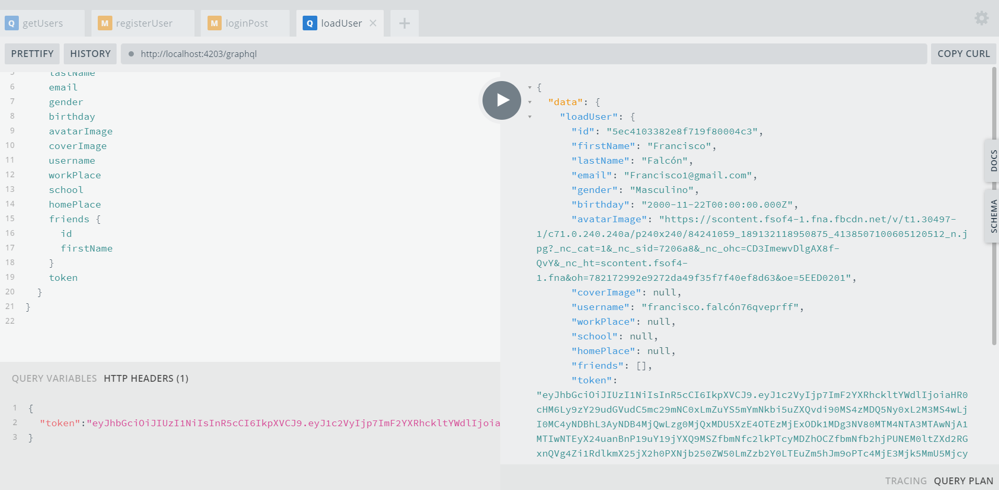

# ***Backend Nodejs - Graphql - Typescript - MongoDB***

### Es necesario tener instalado la última versión estable de [*Node*](https://nodejs.org/en/) y recomendable tener tambien [MongoDB](https://www.mongodb.com/download-center/community) .

#### Reconstruir módulos de Node :
```
npm i
```
#### Actualizar dependencias :
```
npm update
```
#### Levantar el servidor en producción:
```
npm run dev
```
#### Generar archivo para producción :
```
npm run build
```
#### Referential image :
> 

- *Observación:* **Esto es un desarrollo personal con Nodejs - Graphql - Typescript - MongoDB.**


> ***Juan Diego Falcón Córdova*** (Junior Web Developer   :computer: - Perú)